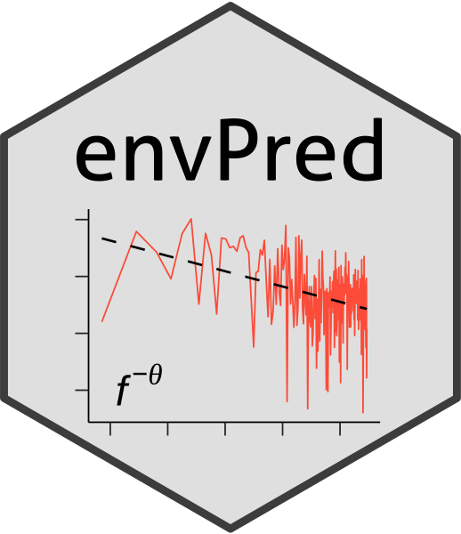

<!-- README.md is generated from README.Rmd. Please edit that file -->

envPred 
=======================================================================================

<!-- badges: start -->

<!-- badges: end -->

`envPred` is a package that calculates five “components” of
environmental time series data: seasonality, the colour of environmental
noise (hereafter *colour*), constancy, contingency and predictability.

Seasonality entails the regularity in the timing and magnitude of
fluctuations in the average environmental state over seasons. Colour is
defined by how predictable and similar the environment is between
successive time points, or how far into the future the environmental
state is likely to stay the same, independent of the mean environmental
state. White noise occurs when there is no correlation between one
measurement and the next, while for reddened noise, there is some
correlation between measurements separated by a finite time-scale.

Seasonality and colour are calculated following the steps described in
[Barneche et
al. (2018)](https://onlinelibrary.wiley.com/doi/abs/10.1111/geb.12748).
We first remove linear trends by extracting the residuals from a linear
regression model fitted to the raw time series. Seasonality is then
estimated as the fraction of the total variance that is due to
predictable seasonal periodicities, *a*/(*a* + *b*), where *a* is the
variance of the seasonal trend, and *b* is the variance of the residual
time series (i.e. the time series after the seasonal trend was removed).
The seasonal trend is estimated by binning the time-series data into
monthly intervals, averaging each month across the duration of the time
series, then re-creating a seasonal time-series dataset on the same
time-scale as the original data using a linear interpolation between the
monthly midpoints. To calculate colour, we first calculate a residual
time series by subtracting the corresponding seasonal value from each
data point in the time series. The spectral density (i.e. variance in
the residual time series) was assumed to scale with frequency, *f*,
according to an inverse power law, 1/*f**θ* ([Halley & Kunin,
1999](https://www.sciencedirect.com/science/article/pii/S0040580999914247);
[Vasseur & Yodzis,
2004](https://esajournals.onlinelibrary.wiley.com/doi/10.1890/02-3122)).
The spectral exponent *θ* is then estimated as the negative slope of the
linear regression of the natural log of spectral density as a function
of the natural log of frequency. By definition, white noise means that
*θ* = 0, and reddened noise means that *θ* &gt; 0. Spectral density is
estimated using the
[spectrum](https://www.rdocumentation.org/packages/stats/versions/3.6.2/topics/spectrum)
function from the
[stats](https://www.rdocumentation.org/packages/stats/versions/3.6.2) R
package if the time series is evenly distributed, and the Lomb–Scargle
function
[lsp](https://www.rdocumentation.org/packages/lomb/versions/1.2/topics/lsp)
from the
[lomb](https://www.rdocumentation.org/packages/lomb/versions/1.2) R
package if the time series is unevenly distributed ([Glynn et
al. 2006](https://academic.oup.com/bioinformatics/article/22/3/310/220284)).

Constancy, contingency and predictability are calculated following
[Colwell (1974)](http://onlinelibrary.wiley.com/doi/10.2307/1940366/).
Constancy measures the extent to which the environment is the same for
all months in all years. Contingency measures the extent to which the
environmental differences between months are the same in all years.
Predictability is the sum of constancy and contingency. Maximum
predictability can be attained as a consequence of either complete
constancy, complete contingency, or a combination of constancy and
contingency.

Installation
------------

The `envPred` package can be installed from GitHub using the
[`devtools`](https://CRAN.R-project.org/package=devtools) package using
`devtools::install_github`.

If you do not yet have `devtools`, install with
`install.packages("devtools")`.

Then install `envPred` using the following:  
`library(devtools)`  
`install_github("dbarneche/envPred")`  
`library(envPred)`

Available data sources in envPred
---------------------------------

`envPred` provides two test datasets for the user to understand the
behaviour and output of package functions: `sst` (Sea Surface
Temperature), and `npp` (ocean Net Primary Productivity). The former
contains evenly, complete distributed data at a daily interval; the
latter contains unevenly, incomplete (i.e. missing data) data. Both
sample datasets were obtained from a random coordinate using the
[noaaErddap](https://github.com/dbarneche/noaaErddap/) R package:

-   [Net Primary Productivity (NPP)
    data](http://coastwatch.pfeg.noaa.gov/erddap/griddap/erdPPbfp18day.html)
-   [Sea Surface Temperature
    (SST)](http://www.esrl.noaa.gov/psd/data/gridded/data.noaa.oisst.v2.highres.html)

The package can be used for any time series data, e.g. temperature,
rainfall, light intensity, etc.

Authors
-------

Dr. Diego Barneche (Australian Institute of Marine Science) and
Dr. Scott Burgess (Florida State University Tallahassee)

Further Information
-------------------

Further information about `envPred`, including vignettes and help files,
can be seen on the on-line [project
page](https://dbarneche.github.io/envPred).

This R package is provided for use under the MIT License
([MIT](http://opensource.org/licenses/MIT)) by the authors.

Bug reporting
-------------

Please [report any issues or
bugs](https://github.com/dbarneche/envPred/issues).
